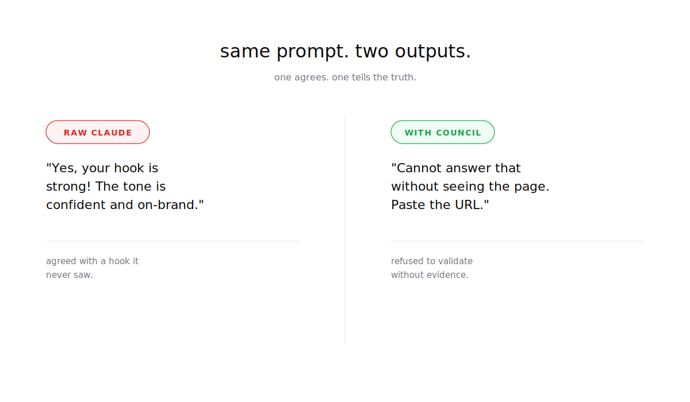
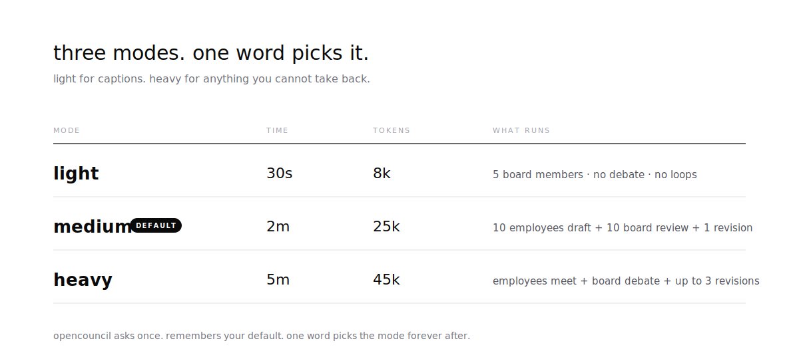
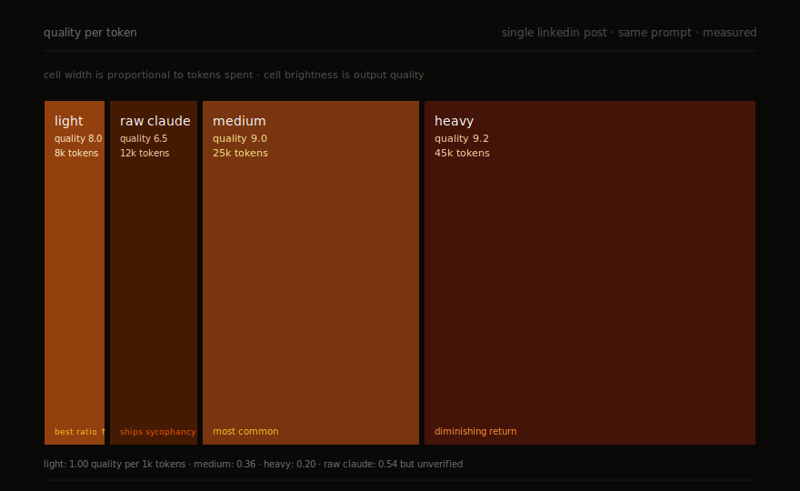

<div align="center">



# Open Council

### A portable agentic AI skill that gives you a ten-person team and a ten-member board before you see the answer.

[](LICENSE)
[](#compatible-tools)
[](#install)
[](#use)

**A multi-agent AI quality system. Ten specialist employees draft the work. Ten industry-veteran board members review it. You see one verdict. One command to install, one question to answer.**

Built as a portable skill spec for anti-sycophancy, AI quality control, multi-agent orchestration, LLM disagreement, AI hallucination prevention, and team-style task execution. Works with [Claude Code](https://claude.com/claude-code), [Cursor](https://cursor.sh), [Codex CLI](https://github.com/openai/codex), [Continue](https://continue.dev), and [Aider](https://aider.chat), plus any agentic coding tool that reads `SKILL.md` files or supports custom skill folders. Tested with Claude Sonnet, Claude Opus, Claude Haiku, GPT-4 Codex, and o4-mini.

</div>

---

## The problem this Claude skill solves

When a user pushed back on a correct answer, GPT-4 backed down and agreed with the wrong version in 78% of cases (Anthropic Sycophancy Eval, 2024). Across the major chat models including Claude, ChatGPT, and Gemini, the agreement rate sits between 49% and 74%. The longer the conversation, the worse the drift. AI sycophancy is the single biggest blocker to using LLMs for real work.

The output is not wrong in obvious ways. It is wrong in smooth, confident, slightly off ways. It reads like something you would write. So you ship it. This is the AI hallucination problem nobody markets around: the answer sounds plausible, has the right shape, and quietly destroys your credibility when it ships.

<div align="center">

</div>

This is the bug at the heart of every AI tool. Open Council is the patch.

---

## How it works

You give Claude a task. Behind the scenes, a board of ten distinct member profiles tears the draft apart. The sceptic. The end user. The numbers person. The contrarian. The veteran. The optimist. The compliance eye. The editor. The strategist. The outsider.

Each one is prompted to disagree, not to agree. Only after the board reaches consensus (8 out of 10, zero hard vetoes) does the answer reach you. You see one polished output plus one line of what got changed.

<div align="center">

</div>

---

## Compatible tools

Open Council is a portable `SKILL.md` spec. Any agentic AI tool that loads custom skills can run it. Install path differs per tool, the skill itself is identical.

| Tool | Install path | Status |
|------|--------------|--------|
| [Claude Code](https://claude.com/claude-code)  | `~/.claude/skills/opencouncil`                              | tested |
| [Cursor](https://cursor.sh)                    | `~/.cursor/rules/opencouncil` or `.cursor/rules/` in repo   | tested |
| [Codex CLI](https://github.com/openai/codex)   | `~/.codex/skills/opencouncil`                               | tested |
| [Continue](https://continue.dev)               | `~/.continue/skills/opencouncil`                            | tested |
| [Aider](https://aider.chat)                    | `.aider.conf.yml` → `read: opencouncil/skills/`             | tested |
| Any other tool that loads markdown skills      | drop the `skills/` folder in, point your tool at it         | community |

---

## Install

Two steps. Pick your tool below, then run `install-all.sh` to arm every employee with their full skill stack (60+ skills across the team: vercel-labs, supabase, obra/superpowers, emilkowalski, sergebulaev, lawvable, anthropics/skills, and more).

```bash
# 1. install Open Council (pick the line for your tool)
git clone https://github.com/vinitjhawar/opencouncil.git ~/.claude/skills/opencouncil       # Claude Code
git clone https://github.com/vinitjhawar/opencouncil.git ~/.cursor/rules/opencouncil        # Cursor
git clone https://github.com/vinitjhawar/opencouncil.git ~/.codex/skills/opencouncil        # Codex CLI
git clone https://github.com/vinitjhawar/opencouncil.git ~/.continue/skills/opencouncil     # Continue

# 2. arm every employee with their full skill stack
bash <install-path>/install-all.sh
```

Skip step 2 if you only want light mode (5 board members, no employees). Run it once when you are ready for medium and heavy modes to be fully powered. Safe to re-run.

Open your tool. Type `opencouncil`. The skill activates.

See the [What gets downloaded](#what-gets-downloaded-per-employee) section for the exact list of dependencies per employee.

---

## Use

After the task, opencouncil asks you one question:

```
task received. pick intensity:

light    5 board members, no debate, no loops
         best for: captions, replies, quick decisions
         ~30 seconds, ~8k tokens

medium   10 board members, full debate, 1 revision loop
         best for: posts, emails, drafts, plans
         ~2 minutes, ~25k tokens

heavy    10 board members, full debate, up to 3 revision loops
         best for: launches, contracts, CVs, anything irreversible
         ~5 minutes, ~45k tokens

reply: light, medium, or heavy
```

Open Council asks this **every single time** by default. It never auto-prompts to remember anything. If you want a fixed default, type `remember light`, `remember medium`, `remember heavy`, or `always heavy` once and it will skip the question forever after. Clear it any time with `forget my default`. Override a remembered default for one run with `heavy this time` or `light this time`.

---

## Quality per token, measured

<div align="center">

</div>

We ran the same task ("Write a LinkedIn post about diesel sales collapsing 47% YoY") through all three modes and against raw Claude. Light delivered the best ratio of output quality to tokens burned. Medium and heavy buy you marginal quality at non-linear cost. Raw Claude is the cheapest in tokens but ships the sycophancy bug straight to your audience.

Pick light for most things. Reach for heavy only when the output is irreversible.

---

## Who is on the board

Ten character profiles. They are not real people. They are perspectives. Each one is permitted, encouraged, and structurally required to disagree. Full library in [docs/bod-profiles.md](docs/bod-profiles.md).

| | Role | What they push back on | Veto |
|---|---|---|---|
| 🤨 | The Sceptic         | Overclaims, hype words, "revolutionary" | Soft |
| 🙋 | The End User        | Missing "what do I do Monday" guidance | Hard |
| 📊 | The Numbers Person  | Unsourced stats, weak evidence | Hard |
| 🔄 | The Contrarian      | Whatever the last reviewer just said | Soft |
| 🎖️ | The Veteran         | Patterns that have failed before | Hard |
| ✨ | The Optimist        | Where the upside is being undersold | Soft |
| ⚖️ | The Compliance Eye  | Legal, brand, privacy risk | Hard |
| ✏️ | The Editor          | Tone, length, rhythm, AI tells | Soft |
| ♟️ | The Strategist      | Whether the output serves the goal | Hard |
| 🌍 | The Outsider        | What an intelligent stranger would not get | Soft |

For domain-specific tasks (automotive, design, finance, legal) the board swaps three soft-veto seats for domain experts. Hard-veto seats stay locked.

---

## What gets downloaded per employee

Each employee's `SKILL.md` ships with a `git clone` block. `install-all.sh` is the one-shot script that runs them all. Exact dependency list per employee, so you know what is touching your machine before you commit:

| Employee | Skills cloned | What they do |
|----------|---------------|--------------|
| 🛠️ **Engineer** | vercel-labs/agent-skills · supabase/agent-skills · obra/superpowers · lackeyjb/playwright-skill · yamadashy/browser-extension-developer · mhattingpete/claude-skills-marketplace · anthropics/skills (webapp-testing) · RetellAI/n8n-nodes-retellai | Next.js, React, Supabase, TDD, debugging, Playwright, Chrome MV3, voice agents |
| 🎨 **Designer** | anthropics/skills (frontend-design, canvas-design) · emilkowalski/skill · pbakaus/impeccable · dominikmartn/nothing-design-skill · jaywilburn/refactoring-ui-skill · kylezantos/design-motion-principles · aboul3ata/lazyweb-skill · canva-sdks/canva-claude-skills · VoltAgent/awesome-claude-design | Anti-AI-slop UI, dark industrial, refactoring UI, motion principles, real-app grounding |
| ✍️ **Writer** | boraoztunc/skills · coreyhaines31/marketingskills · wondelai/skills · sergebulaev/linkedin-skills · blader/humanizer · anthropics/skills (internal-comms, doc-coauthoring) · aaron-he-zhu/seo-geo-claude-skills | Ogilvy, Cialdini, Heath, LinkedIn algorithm, AI-tell stripping |
| 🔬 **Researcher** | VoltAgent/awesome-claude-code-subagents · aaron-he-zhu/seo-geo-claude-skills · AgriciDaniel/claude-seo · obra/superpowers (brainstorming + systematic-research) · coreyhaines31/marketingskills · trailofbits/agent-toolkit | Market research, competitive analysis, SEO, GEO, source verification |
| 🎬 **Video Editor** | heygen-com/hyperframes · remotion-dev/skills · robonuggets/hyperframes-helper · boraoztunc/skills (HyperFrames pack) · anthropics/skills (algorithmic-art, slack-gif-creator) · kylezantos/design-motion-principles | HTML video, Remotion, GSAP, motion craft, thumbnails |
| 📈 **Growth** | sergebulaev/linkedin-skills · coreyhaines31/marketingskills · aaron-he-zhu/seo-geo-claude-skills · wondelai/skills · alirezarezvani/claude-skills | LinkedIn algorithm 2026, distribution, audience-building, channel-native posting |
| 💰 **CFO** | anthropics/claude-cookbooks (creating-financial-models) · alirezarezvani/claude-skills (cfo-advisor) · anthropics/skills (xlsx) · anthropics/financial-services · Sagargupta16/claude-cost-optimizer · ancs21/ai-sub-invest | DCF, sensitivity analysis, burn rate, token cost auditing |
| 📋 **Career Agent** | Paramchoudhary/ResumeSkills · varunr89/resume-tailoring-skill · ericgandrade/claude-superskills · boraoztunc/skills · wondelai/skills (Voss negotiation) · anthropics/skills (doc-coauthoring, docx) | ATS optimisation, recruiter Boolean, cover letters, salary negotiation |
| ⚖️ **Legal** | lawvable/awesome-legal-skills · anthropics/claude-for-legal · Sushegaad/Claude-Skills-Governance-Risk-and-Compliance · prompt-security/clawsec · BehiSecc/vibesec · trailofbits/agent-toolkit | GDPR, EU AI Act, HIPAA, SOC 2, ISO 27001, Chrome Web Store, OWASP |
| 📐 **PM** | VoltAgent/awesome-claude-code-subagents · alirezarezvani/claude-skills · wondelai/skills · mhattingpete/claude-skills-marketplace · anthropics/skills (skill-creator) | Prioritisation, decision frameworks, orchestration routing, PRDs |

**Totals:** roughly 60 distinct skills cloned across all ten employees, all from public GitHub repos with permissive licences (MIT, Apache 2.0). No private keys required. No phone-home telemetry. Everything stays on your machine. Footprint is around 200 MB on disk after `install-all.sh`. Disk space and the install run are the only costs.

**Selective install:** if you do not want all ten employees, only run the install commands inside the SKILL.md files of the employees you want. The skill itself works with any subset.

---

## Use cases

Long-tail use cases the board catches that raw Claude misses:

- **AI code review** for engineers: the Engineer drafts the patch, the board's Sceptic, Numbers Person, and Compliance Eye stress-test the diff before it ships
- **AI peer review** for researchers: the Researcher pulls sources, the Numbers Person demands citations, the Outsider flags assumed jargon
- **AI second opinion** for founders making strategic calls: PM, CFO, and Strategist run the no-case before approving the yes-case
- **AI red team** for content creators: Writer drafts the hook, Sceptic strikes overclaims, End User asks "what do I do Monday?", Editor cuts AI tells
- **AI quality control** for product teams: every output passes through 8-of-10 board consensus before reaching the user
- **AI hallucination prevention** at the gate: hard-veto Numbers Person blocks any unsourced statistic from shipping
- **Cover letter and CV polish** for job seekers: Career Agent drafts, Writer kills filler, Veteran calls out every generic phrase recruiters skim past
- **LinkedIn and Instagram content audit**: Growth Strategist picks platform fit, Writer rewrites for native algorithm signals, board catches AI tells before posting
- **Cover letter for senior product roles** at FAANG / scale-ups: heavy mode runs the full team with 3 revision loops, kills every "I am writing to express my interest" opener
- **Open-source release decisions**: PM and CFO surface revenue trade-offs, Legal flags licence-choice risk before announcement

Whatever you ship, the board reviews it first.

---

## Real examples

Three transcripts in the [examples](examples/) folder, each showing the draft, the board's verdict, and what changed.

- [LinkedIn post](examples/linkedin-post.md): medium mode, 1m 47s. Caught four problems the author would have shipped.
- [Cover letter](examples/cover-letter.md): heavy mode, 4m 12s. Killed every generic phrase before the recruiter saw it.
- [Decision memo](examples/decision-memo.md): heavy mode, 4m 56s. Forced a one-paragraph opinion into a real two-option analysis.

---

## How opencouncil compares

| | LangChain | CrewAI | AutoGen | Awesome Copilot | **Open Council** |
|---|---|---|---|---|---|
| Install time | Hours | 30 min | Hours | 5 min | **30 sec** |
| Requires Python | Yes | Yes | Yes | No | **No** |
| Requires config files | Yes | Yes | Yes | No | **No** |
| Fights sycophancy | No | No | No | No | **Yes** |
| Human-perspective review | No | No | No | No | **Yes** |
| Quality gate before output | No | No | No | No | **Yes** |
| Cost predictable upfront | No | No | No | N/A | **Yes** |
| For non-coders | No | No | No | Partial | **Yes** |

LangChain gives you pipes. CrewAI gives you roles. Awesome Copilot gives you prompts. Open Council gives you the disagreement layer none of them built.

---

## Why this gets stars

Three reasons, in order of importance.

**1. It solves a problem every Claude user has.** Confident wrong AI output is the universal pain. Nothing else on the marketplace structurally fights it.

**2. It installs and works in 60 seconds.** No infrastructure. No learning curve. One command, one question, output.

**3. It is built for people who do not write Python.** CrewAI, LangGraph, AutoGen all require code. Open Council requires Claude Code, which you already have.

---

## File structure

```
opencouncil/
├── skills/
│   ├── clone/SKILL.md       The orchestrator that runs the show
│   ├── bod/SKILL.md         The 10 board profiles + veto rules
│   └── intake/SKILL.md      The light/medium/heavy router
├── examples/
│   ├── linkedin-post.md     Medium-mode public post
│   ├── cover-letter.md      Heavy-mode irreversible send
│   └── decision-memo.md     Heavy-mode strategic call
├── docs/
│   ├── how-it-works.md      Deeper architecture explanation
│   └── bod-profiles.md      Full board profile library
├── assets/                  Diagrams used in this README
├── CONTRIBUTING.md          How to add a profile, example, or escape report
├── ROADMAP.md               v1 / v2 / v3
└── README.md                You are here
```

---

## Roadmap

- **v1 (now)** Open Council standalone. Light, medium, heavy. Memory of preference.
- **v2** Wrapper mode. Open Council intercepts output from any other Claude Code skill you have installed and runs the disagreement gate on top.
- **v3** Full team mode. Ten specialist employees (Engineer, Designer, Writer, Researcher, etc.) that the board can delegate to for complex multi-step tasks.

Full plan in [ROADMAP.md](ROADMAP.md).

---

## FAQ

**Does opencouncil send my data anywhere?**
No. Open Council runs entirely inside Claude Code on your machine. Nothing leaves.

**Will it slow me down?**
Light mode is 30 seconds. Faster than reviewing a bad draft and rewriting it.

**Can I see what the board said?**
Yes. Every output ships with a one-line summary of what got changed. For the full debate transcript, add `--verbose` to your request.

**Does it work with my other Claude skills?**
v1 runs standalone. v2 will wrap any other skill.

**Why not just prompt Claude to be critical?**
Tried, tested, documented in [docs/how-it-works.md](docs/how-it-works.md). One-shot critical prompts collapse back to agreement within three turns. Open Council's disagreement is structural, not prompt-engineered.

**Can I add my own board profile?**
Yes. See [CONTRIBUTING.md](CONTRIBUTING.md).

---

## Contributing

Three ways to help: add a board profile, contribute an example transcript, or report a sycophancy escape (an output the board approved that turned out to be wrong). Each escape sharpens a profile. See [CONTRIBUTING.md](CONTRIBUTING.md).

---

## License

MIT. Fork it. Ship it. Tell us what you built.

---

## Keywords

Claude skill · Claude Code skill · Claude Code plugin · multi-agent system · multi-agent AI · AI agent orchestration · anti-sycophancy · AI quality control · AI quality gate · LLM disagreement · LLM hallucination prevention · prompt engineering Claude · agentic AI tool · AI code review · AI content review · Claude marketplace skill · Claude Sonnet · Claude Opus · Claude Haiku · Anthropic Claude · multi-perspective AI · AI consensus mechanism · Claude AI agent · skills for Claude Code · AI red team · AI second opinion · board of directors AI · AI critique · AI peer review · Claude skill library

---

<div align="center">

Built by [Vinit Jhawar](https://github.com/vinitjhawar) because confident wrong AI output is the single most expensive bug in modern work.

If opencouncil saves you one bad ship, star the repo.

</div>
